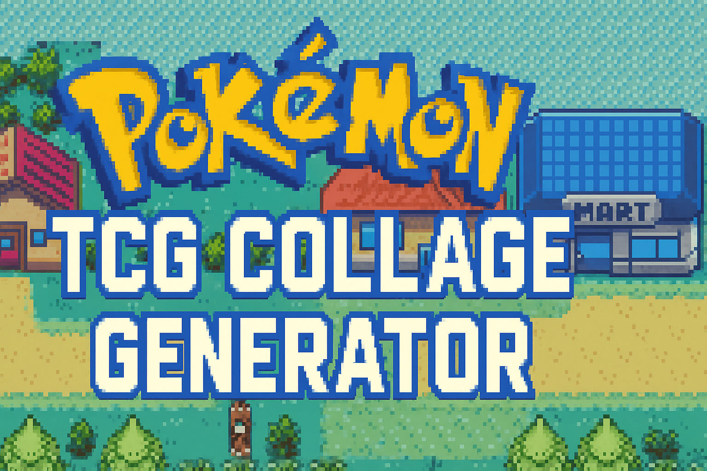
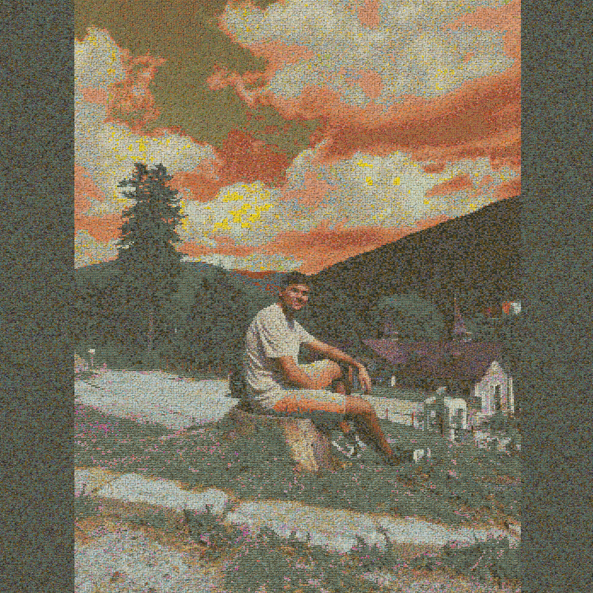

# PokemonTCG-Gen
🌟 Pokémon TCG Collage Generator + 📷 Live Card Scanner

A high-resolution collage generator using thousands of Pokémon TCG cards,
**plus** a real-time webcam/phone-camera card identifier with market-price lookup.

<p align="center">
  
</p>

## 📑 Table of Contents
- [Overview](#overview-)
- [Project Structure](#project-structure-)
- [Scanner – Quick Start](#scanner--quick-start-)
- [Scanner – Architecture](#scanner--architecture-)
- [Scanner – API Reference](#scanner--api-reference-)
- [Requirements](#requirements-)
- [Installation](#installation-)
- [Dataset Download & Setup](#dataset-download--setup-)
- [Color Preprocessing](#color-preprocessing-)
- [Generating The Collage](#generating-the-collage-)
- [Available Algorithms](#available-algorithms-)
- [Collage Algorithm Parameters](#collage-algorithm-parameters)
- [TIFF Support](#tiff-support-)
- [Images](#images-)
- [Performance Notes](#performance-notes-)
- [Troubleshooting](#troubleshooting-)


## Overview 🧩

This project generates ultra-high-resolution image mosaics using Pokémon TCG card art.
It loads an input image, splits it into blocks, and finds the closest matching Pokémon card for each block using LAB color distance, HSV weighting, saturation awareness, and optional rotation/displacement.

Outputs can reach 7000×7000 or more and are suitable for large prints and posters.

## Project Structure 📁
```bash
PokemonTCG-Gen/
│
├── populate-pokemon-db.py        # dataset ingestion
├── preprocess-color-pokemon.py   # LAB/HSV colour preprocessing
├── aggregate-pokemon-images.py   # mosaic generation
│
├── build_index.py                # build phash index for scanner
├── sync_prices.py                # sync market prices from pokemontcg.io
├── start_server.py               # launch the scanner web server
│
├── api/                          # FastAPI scanner backend
│   ├── app.py
│   ├── config.py
│   ├── db.py
│   ├── identifier.py
│   └── pricer.py
│
├── static/                       # Single-page scanner UI
│   ├── index.html
│   └── app.js
│
├── tests/                        # Unit tests (pytest)
│   ├── test_identifier.py
│   └── test_pricer.py
│
├── Pokémon Mosaics - Database/
├── images/
├── input_test/
└── output_test/
```


## Scanner – Quick Start 📷

> **Prerequisites:** complete the [Dataset Download & Setup](#dataset-download--setup-) and [Color Preprocessing](#color-preprocessing-) steps first so the local card images and DB are populated.

### 1 – Build the visual match index

```bash
python build_index.py
# Add --force to rebuild already-indexed cards.
# Add --limit N to test with N cards first.
```

### 2 – Sync market prices (optional but recommended)

```bash
python sync_prices.py
# Add --set-id base1 to sync only one set.
# Set POKEMONTCG_API_KEY env var for higher rate limits.
```

### 3 – Start the scanner server

```bash
python start_server.py
# Listens on 0.0.0.0:8000 by default so phones on the same LAN can connect.
# Use --port 8080 to change the port.
# Use --reload for development auto-reload.
```

### 4 – Open the scanner

- **Desktop webcam:** open `http://localhost:8000` in Chrome/Firefox.
- **Phone camera:** open `http://<your-computer-ip>:8000` in the phone browser.

Hold a Pokémon TCG card in front of the camera and tap **Scan Card** (or enable **Auto-Scan** for continuous scanning).


## Scanner – Architecture 🏗

```
Browser / Phone camera
        │  JPEG frame (multipart POST)
        ▼
  FastAPI  /api/identify
        │
        ├── detect_card_crop()    OpenCV contour → perspective warp
        ├── quality_check()       Laplacian blur variance
        ├── compute_phash()       64-bit perceptual hash
        ├── find_matches()        numpy XOR popcount over in-memory index
        │                         └─ card_match_index table (MySQL)
        └── enrich with metadata + prices
                └─ cards_classification / cards_art / card_prices (MySQL)
        │
        ▼
  JSON response  {matches, card_detected, quality_ok, latency_ms}
        │
        ▼
  SPA (static/index.html + app.js)  renders results
```

**Key design decisions**

| Concern | Choice | Rationale |
|---------|--------|-----------|
| Matching algorithm | Perceptual hash (pHash) | Rotation/lighting-robust; O(N) numpy comparison over 18 K cards in <1 ms |
| Price source | pokemontcg.io v2 API | Free tier, returns TCGplayer + Cardmarket data |
| Camera on phone | `facingMode: {ideal: 'environment'}` in WebRTC | Back camera by default; flip button for front |
| Index storage | MySQL `card_match_index` | Re-uses existing DB; loaded into RAM at startup |


## Scanner – API Reference 📡

| Method | Path | Description |
|--------|------|-------------|
| `GET`  | `/health` | Liveness probe |
| `POST` | `/api/identify` | Upload image → top-K matches + prices |
| `GET`  | `/api/cards/{id}` | Card metadata + all stored prices |
| `GET`  | `/` | Scanner SPA |

### POST /api/identify

**Request:** `multipart/form-data` with field `file` (JPEG or PNG).

**Response:**
```json
{
  "card_detected": true,
  "quality_ok": true,
  "quality_reason": "ok",
  "latency_ms": 42.1,
  "matches": [
    {
      "card_id": "base1-4",
      "hamming_distance": 3,
      "confidence": 0.906,
      "card": {
        "name": "Charizard", "set_name": "Base Set", "number": "4",
        "rarity": "Rare Holo", "small_image": "...", "large_image": "..."
      },
      "best_price": {
        "source": "tcgplayer", "market": "holofoil",
        "currency": "USD", "condition": "market",
        "price": 349.99, "captured_at": "2024-05-01T00:00:00"
      }
    }
  ]
}
```


## Requirements ✅

- Python 3.10+
- MySQL 8+
- OpenCV
- NumPy
- TiffFile
- MySQL Connector
- Pillow
- ColorMath
- FastAPI + Uvicorn *(scanner)*
- imagehash *(scanner)*
- scipy *(scanner)*


## Requirements ✅

- Python 3.10+

- MySQL 8+

- OpenCV

- NumPy

- TiffFile

- MySQL Connector

- Pillow

- ColorMath

## Installation 🛠
- Clone
```bash
git clone https://github.com/mmitzy/PokemonTCG-Gen.git
cd PokemonTCG-Gen
```

- Create venv
```bash
python -m venv .venv
.\.venv\Scripts\activate
pip install -r requirements.txt
```

## Dataset Download & Setup 📥

Run:

```bash
python populate-pokemon-db.py
```

Creates all tables + downloads all official Pokémon TCG images + fills DB.

## Color Preprocessing 🎨

Run:

```bash
python preprocess-color-pokemon-db.py
```

This computes average/median colors in RGB, HSV, LAB and stores them in MySQL.

## Generating The Collage 🧱

Example (7K resolution):

```bash
python aggregate-pokemon-images.py input_test --algorithm collage --size 7000x7000 --timeout 9999 --output output_test/final.png --config "width=20,height=20,candidates=2000,prefilter=30,tolerance=8,saturation=0.4"
```

## Available Algorithms 🧠
-collage: The main Pokémon mosaic engine
-average: Pixel averages
-median: Pixel medians
-average_row: Row collapsing
-average_square: Block averages
-similarity_heatmap: Card similarity map
-compose_columns: Column-stacked composition
-test: Debug mode

## Collage Algorithm Parameters

```bash
--config "width=20,height=20,candidates=2000,prefilter=30,tolerance=8,saturation=0.4,rotation=15,displacement=1"
```

Parameter meanings:

-width,height: Tile size
-candidates: SQL candidate depth
-prefilter: LAB quick filter
-tolerance: Max CIEDE2000 distance
-saturation: Weight for color saturation
-rotation: Random angle per tile
-displacement: Pixel jitter
-repeat: Allow card reuse

## TIFF Support 🖼

TIFF is recommended for huge outputs (≥4000×4000):

✔ Supports massive resolutions
✔ Lossless
✔ Photoshop/GIMP compatible
✔ deflate and lzw compression supported

Example:
```bash
--output output_test/final.tiff --compression deflate
```

## Images 📸

UNFINISHED, IMAGES ARE SOON TO BE ADDED

1. Fast Test – 512×512
Input  Output
	
2. Medium – 2048×2048

3. High – 4096×4096

4. Ultra High – 7000×7000

5. Sky Correction
Before  After
	

## Performance Notes 🚀

Large collages (7000×7000) can take 8-24 hours

Use --timeout 9999 to avoid automatic termination

Avoid system sleep mode

Increase candidates, prefilter, saturation for better color fidelity

## Troubleshooting 🩹
❗ No candidates found

Increase:
```bash
prefilter=40
candidates=2500
tolerance=10
```

❗ Sky turns red

Use:
```bash
saturation=0.4 or 0.5
prefilter=30+
```

❗ Script stops

Add:
```bash
--timeout 9999
```